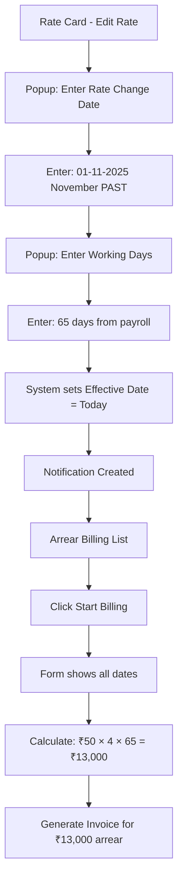

# ✅ CORRECTED: Arrear Billing with Working Days from Payroll

## 🎯 What is Arrear Billing?

Arrear Billing is when you need to bill a client for **PAST work** done at an OLD rate, before implementing a NEW rate going forward.

---

## 📅 Correct Date Logic

### **The Correct Understanding:**

1. **Rate Change Date** = **PAST DATE** (e.g., November 1, 2025)
   - When the rate was actually changed/increased

2. **Effective Date** = **TODAY** (e.g., January 10, 2026)
   - When the NEW rate becomes effective **going forward**

3. **Arrear Period** = **Rate Change Date to Yesterday**
   - From: November 1, 2025 (when rate was changed)
   - To: January 9, 2026 (yesterday - last day of old rate)
4. **Working Days** = **From Payroll Data** (NOT calendar days)
   - Actual days employees worked in the arrear period
   - Example: 65 working days (excludes Sundays, holidays, etc.)

---

## 🧮 Real Business Scenario

### Scenario:

Your company provides security guards to a client. On **November 1, 2025**, you increased the guard rate from ₹800 to ₹850 per day.

**Timeline:**

- **November 1, 2025**: Rate increased to ₹850/day (Rate Change Date - PAST)
- **November 1 to January 9, 2026**: Arrear Period (past work at old rate)
- **January 10, 2026**: New rate becomes effective (Effective Date - TODAY)

### The Problem:

- Employees worked **65 days** from November to January (from payroll data)
- You were billing at **₹800/day** (old rate) during this period
- You should have been billing at **₹850/day** (new rate)
- **Difference**: ₹50/day per employee
- **Arrear**: Money owed for the past period

### Calculation:

```
Old Rate: ₹800/day
New Rate: ₹850/day
Difference: ₹50/day per employee

Number of Employees: 4 Security Guards
Working Days (from Payroll): 65 days
Arrear Period: Nov 1, 2025 to Jan 9, 2026

Arrear Amount = Difference × Employees × Working Days
Arrear Amount = ₹50 × 4 × 65
Arrear Amount = ₹13,000
```

**This ₹13,000 is the ARREAR you need to bill the client for past work!**

---

## 🔄 How It Works in the System

### Step 1: Rate Card Change

When you update a rate in the Rate Card page:

1. **First Popup**: "Enter the Rate Change Date (DD-MM-YYYY)"
   - Enter: `01-11-2025` (November 1, 2025 - PAST DATE)
   - This is when the rate was actually changed

2. **Second Popup**: "Enter Total Working Days from Payroll"
   - Enter: `65` (actual working days from payroll)
   - This is NOT calendar days (which would be ~70)
   - This accounts for Sundays, holidays, absences, etc.

3. **System automatically sets**:
   - Effective Date = Today (January 10, 2026)
   - This is when the NEW rate applies going forward

### Step 2: Notification Created

```javascript
{
  client: "Tech Solutions Ltd",
  designation: "Security Guard",
  oldDailyRate: 800,
  newDailyRate: 850,
  rateChangeDate: "2025-11-01" (PAST - November),
  effectiveDate: "2026-01-10" (TODAY),
  totalWorkingDays: 65 (from payroll),
}
```

### Step 3: Arrear Billing Form

The form automatically calculates:

- **Rate Change Date (Past)**: November 1, 2025 [ORANGE]
- **Effective Date (Today)**: January 10, 2026 [BLUE]
- **Arrear Period Start**: November 1, 2025 [GREEN]
- **Arrear Period End**: January 9, 2026 (Yesterday) [GREEN]

**Rate Changes Table:**
| Designation | Old Rate | New Rate | Difference | Employees | Working Days | Arrear Amount |
|-------------|----------|----------|------------|-----------|--------------|---------------|
| Security Guard | ₹800 | ₹850 | ₹50 | 4 | 65 | ₹13,000 |

---

## 📊 Date Fields Explanation

### 🟠 Rate Change Date (ORANGE - Past)

- **What**: When the rate was actually changed
- **Example**: November 1, 2025
- **Purpose**: Marks the START of the arrear period
- **Editable**: No (comes from rate card)

### 🔵 Effective Date (BLUE - Today)

- **What**: When the NEW rate becomes effective going forward
- **Example**: January 10, 2026 (Today)
- **Purpose**: Marks when to start billing at the NEW rate
- **Editable**: No (automatically set to today)

### 🟢 Arrear Period Start (GREEN)

- **What**: Same as Rate Change Date
- **Example**: November 1, 2025
- **Purpose**: First day of arrear billing
- **Editable**: Yes (if needed)

### 🟢 Arrear Period End (GREEN)

- **What**: Yesterday (day before effective date)
- **Example**: January 9, 2026
- **Purpose**: Last day of old rate / arrear billing
- **Editable**: Yes (if needed)

---

## 📈 Working Days vs Calendar Days

### ❌ Calendar Days (WRONG):

```
From: Nov 1, 2025
To: Jan 9, 2026
Total: 70 days

Problem: Includes Sundays, holidays, absences
Result: Overcharging the client!
```

### ✅ Working Days from Payroll (CORRECT):

```
From: Nov 1, 2025
To: Jan 9, 2026
Total: 65 working days (from payroll records)

Benefits:
- Excludes Sundays (9 Sundays in 70 days)
- Excludes holidays
- Reflects actual work done
- Matches payroll records
Result: Accurate billing!
```

---

## 🧪 How to Test

### Test Scenario 1: Standard Rate Increase

1. **Go to Rate Card Page**
   - Client: Tech Solutions Ltd
   - Site: Head Office
   - Designation: Security Guard
   - Current Rate: ₹800

2. **Edit the Rate**
   - Click Edit
   - Change to: ₹850
   - Click Save

3. **First Popup - Rate Change Date**

   ```
   Enter: 01-11-2025
   (November 1, 2025 - 2 months ago)
   ```

4. **Second Popup - Working Days**

   ```
   Enter: 65
   (Working days from payroll for Nov-Jan)
   ```

5. **Expected Notification**

   ```
   Rate Change Date: Nov 1, 2025 (past)
   Effective Date: Jan 10, 2026 (today)
   Total Working Days: 65
   ```

6. **Go to Arrear Billing Page**
   - See notification for Tech Solutions Ltd
   - Click "Start Billing"

7. **In Arrear Billing Form, Verify:**
   - Rate Change Date: Nov 1, 2025 [ORANGE field]
   - Effective Date: Jan 10, 2026 [BLUE field]
   - Arrear Period Start: Nov 1, 2025 [GREEN field]
   - Arrear Period End: Jan 9, 2026 [GREEN field]
   - Working Days: 65 (in table)
   - Arrear Amount: ₹13,000 (₹50 × 4 × 65)

---

## 🎓 Key Concepts

### What is "Arrear"?

- **Arrear** = Money owed for past work
- When rates increase but billing was done at old rate
- Need to bill the difference for the past period

### Why Two Dates?

- **Rate Change Date (Past)**: When the rate was actually increased
- **Effective Date (Today/Future)**: When to start billing at new rate
- **Gap between them**: Arrear period (needs backdated billing)

### Why Working Days?

- Payroll calculates salary based on actual working days
- Billing should match payroll records
- More accurate than calendar days
- Accounts for:
  - Sundays / weekly offs
  - Public holidays
  - Employee absences
  - Site-specific working patterns

---

## 📋 Complete Workflow



---

## 💼 Business Logic Summary

### Before Today:

- **Nov 1, 2025 to Jan 9, 2026**: Arrear Period
- Billed at: ₹800/day (old rate) ❌
- Should have billed: ₹850/day (new rate) ✅
- Difference: ₹50/day × 4 employees × 65 working days = **₹13,000 ARREAR**

### From Today Onwards:

- **Jan 10, 2026 onwards**: New Rate Effective
- Bill at: ₹850/day (new rate) ✅
- No more arrears (unless another rate change)

---

## 🎯 Success Criteria

After testing, you should see:

✅ Rate change popup asks for PAST date (November)
✅ Working days popup asks for payroll data
✅ Notification stores both dates correctly
✅ Form shows Rate Change Date as PAST (orange)
✅ Form shows Effective Date as TODAY (blue)
✅ Arrear Period is November to Yesterday (green)
✅ Working Days is 65 (from payroll, not 70 calendar days)
✅ Arrear Amount = ₹13,000 (₹50 × 4 × 65)
✅ Info box explains the logic clearly
✅ Formula box shows correct calculation

---

## 🔧 Troubleshooting

### Issue: Seeing 70 days instead of 65

- **Problem**: Using calendar days instead of working days
- **Solution**: System now uses `totalWorkingDays` from notification

### Issue: Dates are confusing

- **Remember**:
  - **ORANGE** = Past (November)
  - **BLUE** = Today (January)
  - **GREEN** = Arrear Period (November to Yesterday)

### Issue: Wrong arrear amount

- **Check**:
  - Difference = New Rate - Old Rate
  - Employees = From PAYROLL_DATA
  - Working Days = From popup input (not calculated)
  - Formula = Difference × Employees × Working Days

---

## 📞 Need Help?

**Common Questions:**

**Q: Why is Rate Change Date in the past?**
A: Because that's when the rate was actually changed. We're billing arrears for that past period.

**Q: Why is Effective Date today?**
A: Because from today onwards, we start billing at the new rate. No more arrears.

**Q: Why not use calendar days?**
A: Calendar days include Sundays, holidays, absences. Working days from payroll is accurate.

**Q: What if I enter wrong working days?**
A: You can edit the "Working Days (Payroll)" field in the table later.

---

## ✨ Final Notes

This system now correctly handles:

- ✅ Rate changes that happened in the past
- ✅ Billing arrears for the gap period
- ✅ Using actual working days from payroll
- ✅ Clear visual indicators (color-coded fields)
- ✅ Accurate calculations matching business requirements
- ✅ New rate effective from today going forward

**The billing is now aligned with real-world business processes!** 🎉
